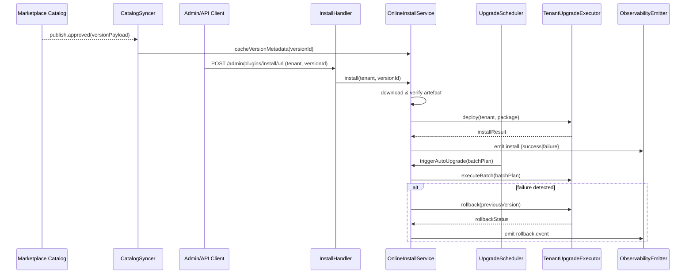

doc_id: PX-PUBLISH-ONLINE-001
scn_id: SCN-PUBLISH-HUB-001
title: PX-PUBLISH-ONLINE-001 - service/catalog
status: Draft
version: v0.1.0
repo_key: powerx
scope: powerx
layer: service
domain: catalog
scenario_title: "PowerX 插件开发与分发全链路"
owners:
  - name: Michael Hu
    role: Tech Steward
    contact: tech@artisan-cloud.com
  - name: Matrix-X
    role: Docs Coordinator
    contact: dev@artisan-cloud.com
contributors:
  - name: Zheng Ning
    role: Ops Lead
    contact: ops@artisan-cloud.com
  - name: Carol Wang
    role: Platform PM
    contact: carol@artisan-cloud.com
linked_requirements:
  - type: scenario
    ref: SCN-PUBLISH-HUB-001
  - type: scenario
    ref: SCN-PUBLISH-ONLINE-001
code_refs:
  - component: pipeline_service
    path: backend/internal/service/plugin_release/pipeline/service.go
    description: 接收发布申请、生成发布计划与审批轨迹
  - component: runtime_service
    path: backend/internal/service/plugin_release/runtime/service.go
    description: 负责灰度批次、指标监控、自动回滚
  - component: grpc_server
    path: backend/internal/transport/grpc/plugin_release/server.go
    description: 暴露 `TriggerCanary`、`FinalizeDeployment` 和 CLI 所需的 gRPC 接口
  - component: admin_deployment_handler
    path: backend/internal/transport/http/admin/plugin_release/deployment_handler.go
    description: Admin `/plans/:id/deploy/*` HTTP API 入口
feature_flags:
  - name: PX_ONLINE_INSTALL
    description: 控制 `install/url` API 是否开放以及可访问的来源域名
    default: true
    environments: [staging, production]
  - name: PX_ONLINE_AUTO_UPGRADE
    description: 启用自动升级调度与回滚保护
    default: false
    environments: [staging, production]
last_reviewed_at: 2025-10-28

---

# Usecase Overview

- **业务目标**：为联网环境提供稳定、安全的插件远程安装与升级能力，自动拉取 Marketplace 上架版本并在租户间按策略分发。
- **成功度量**：在线安装成功率 ≥ 98%；从发布到租户可见的延迟 ≤ 15 分钟；自动升级失败回滚率 ≤ 2%；安装 API P95 时延 ≤ 3s。
- **场景关联**：承接 `PLG-PUBLISH-ONLINE-001` 的 publish 回执和 `MKP-PUBLISH-ONLINE-001` 审核结果，为 `PX-PUBLISH-ONLINE-UI-001` Admin 界面提供 API 与状态。

PowerX Core 服务负责从 Marketplace 获取通过审核的插件版本，按照租户策略执行远程下载、验签、部署、自动升级与回滚，并通过 Admin/Telemetry 提供可观测性。

# Context & Assumptions

- **前置条件**
  - Feature Flag `PX_ONLINE_INSTALL=1` 在目标环境启用，并配置允许访问的 Marketplace 域名与 CDN。
  - Marketplace 已发布版本并提供可访问的 artefact URL、签名、完整性信息。
  - Core 拥有对象存储或本地缓存目录，用于临时存放下载包。
  - 已建立租户级自动升级策略（灰度批次、黑白名单、窗口期）并持久化在配置中心。
  - 审计与监控管道可接收安装事件、指标与告警。
- **输入**
  - Admin/CLI 发起的 `install/url`、`upgrade/schedule` 请求（包含租户、版本、策略）。
  - Marketplace Catalog 同步的版本元数据（版本号、依赖、兼容性标记、风险等级）。
  - 自动升级调度器触发的定时事件。
- **输出**
  - 安装/升级结果（成功/失败/回滚）、运行时状态、审计日志与指标。
  - 缓存更新后的插件 catalog 以及租户可见的版本列表。
  - 告警/通知（Webhook、Slack、邮件）与 Telemetry 事件。
- **边界**
  - 不负责 Marketplace 审核或版本发布（由 Marketplace 实现）。
  - 不覆盖 Admin UI 呈现（由 `PX-PUBLISH-ONLINE-UI-001` 管理）。
  - 不处理离线包导入（对应 `PX-PUBLISH-OFFLINE-001`）。

# Solution Blueprint

## 体系分解

| 模块 | Scope | 职责 | 代码入口 / Host |
|------|-------|------|-----------------|
| MarketplaceCatalogSyncer | powerx | 订阅 Marketplace 发布事件、定期同步版本元数据 | `backend/internal/plugins/catalog/catalog_syncer.go` |
| OnlineInstallService | powerx | 拉取远程包、验签、部署、管理安装状态机 | `backend/internal/plugins/online/install_service.go` |
| PackageFetcher | powerx | 处理 CDN/对象存储下载、断点续传、缓存淘汰 | `backend/internal/plugins/online/package_fetcher.go` |
| UpgradeScheduler | powerx | 根据策略生成自动升级任务、灰度批次、回滚窗口 | `backend/internal/plugins/online/upgrade_scheduler.go` |
| TenantUpgradeExecutor | powerx | 针对租户执行升级、监控结果、处理失败回滚 | `backend/internal/plugins/online/upgrade_executor.go` |
| ObservabilityEmitter | powerx | 输出安装/升级指标、事件、审计日志 | `backend/internal/plugins/telemetry/emitter.go` |
| AdminInstallHandler | powerx | 暴露 `POST /admin/plugins/install/url` API，校验权限并触发服务层 | `backend/cmd/app/http/handlers/plugins/install_url_handler.go` |

## 流程与时序

# Contracts & Interfaces

- **Inbound APIs / CLI**
  - `POST /api/admin/plugin-release/candidates` + `/plans`：发布经理在 Web Admin 中触发审批与生成发布计划。
  - `POST /api/admin/plugin-release/plans/:planId/deploy/*`：触发灰度、Finalize、Rollback。
  - `px publish deploy --plan-id <id> --batch-name batch-a --final-action promote`：CLI 入口，复用 gRPC `TriggerCanary`、`FinalizeDeployment`。
  - `GET /api/admin/plugin-release/candidates/:id`：查询审批进度、门禁状态与可用版本。
- **Outbound 交互**
  - Marketplace Catalog Event（如 `publish.approved` 消息或轮询接口）——同步版本元数据。
  - Package Storage（S3/OSS/CDN）——下载 artefact，支持预签名 URL、断点续传。
  - Telemetry / Metrics API —— `POST /telemetry/powerx/plugins/install`，记录耗时、成功率、失败原因。
  - Notification Service —— 触发 Ops 通知或租户消息（Webhook/Slack/Email）。
- **配置项**
  - `PluginReleaseOptions.FeatureFlags.EnablePipelineDeployment`：控制 guardrail/pipeline 是否可用。
  - `PluginReleaseOptions.Canary.RollbackTimeout`：定义 5 分钟自动回滚 SLA。
  - `PluginReleaseOptions.Distribution.EscalationThreshold`：与 Marketplace Listing 补件策略共享。

# Implementation Checklist

| 项目 | 描述 | 完成状态 | 负责人 |
|------|------|----------|--------|
| 版本同步 | 接入 Marketplace 发布事件、构建本地 catalog 缓存 | [ ] | Platform Services Team |
| 下载与缓存 | 支持 CDN/OSS 下载、断点续传、哈希校验与缓存管理 | [ ] | Platform Services Team |
| 安装状态机 | 实现安装阶段、重试、幂等与回滚保护 | [ ] | Plugin Runtime Team |
| 自动升级调度 | 支持灰度批次、黑白名单、窗口期与暂停/恢复 | [ ] | Ops Automation Team |
| 审计与指标 | 输出 install/upgrade 指标、审计日志、告警钩子 | [ ] | Observability Team |
| 文档与 SOP | 更新运行手册、常见故障、回滚流程、Admin 指南 | [ ] | Docs Steward Team |

# Testing Strategy

- **单元测试**：`install_service_test.go` 覆盖下载、验签、失败重试；`upgrade_scheduler_test.go` 验证批次生成与策略合规；`catalog_syncer_test.go` 检查版本同步。
- **集成测试**：使用 Mock Marketplace/Storage/Telemetry，运行 `make test-online-install`（或等效脚本）覆盖完整安装链路。
- **端到端测试**：与 Marketplace、Admin UI 联合演练“publish → sync → install → auto-upgrade → rollback”，记录审计 ID 与通知。
- **非功能测试**：大包（>500MB）下载性能、弱网超时、并发安装（≥ 20 租户）、自动升级批次压力、SLA 验证。

# Observability & Ops

- **指标**：`plugins.online_install.success_rate`, `plugins.online_install.duration_ms`, `plugins.auto_upgrade.batch_latency`, `plugins.online_install.rollback_count`.
- **日志**：结构化事件记录 `tenantId`, `versionId`, `installJobId`, `phase`, `duration`, `result`, `errorCode`；敏感字段脱敏。
- **告警**：安装失败超过阈值、批次升级失败率 > 5%、下载超时、回滚频率异常时推送至 PagerDuty 与 `#powerx-ops`。
- **Dashboards**：Grafana “Plugins Online Install” 面板、Telemetry Publish Funnel、Ops 升级批次追踪图、Audit Review Dashboard。

# Rollback & Failure Handling

- **回滚步骤**：通过 `PX_ONLINE_AUTO_UPGRADE=0` 暂停自动升级；调用 `POST /api/admin/plugins/upgrade/rollback` 回滚至上一稳定版本；清理缓存并刷新租户状态。
- **补救措施**：提供 `px plugins install --resume <installJobId>` CLI 支援；保存失败包与日志；针对重复失败的租户触发手动干预 SOP。
- **数据修复**：核对 catalog 与实际版本状态，重新同步 Marketplace；修复审计日志缺失；如安装过程损坏数据库，执行迁移回滚与数据修复脚本。

# Risks & Mitigations

| 风险/事项 | 影响 | 缓解方案 | 负责人 | ETA |
|-----------|------|----------|--------|-----|
| CDN 下载失败或延迟 | 安装超时、租户体验下降 | 引入多源下载、断点续传、重试与回退缓存 | Platform Services Team | 2025-02-10 |
| 自动升级批次失控 | 大面积故障 | 增加批次暂停、动态阈值、失败快速回滚 | Ops Automation Team | 2025-01-28 |
| 版本依赖不兼容 | 安装/运行失败 | 在安装前校验依赖矩阵、阻断高风险版本、通知 Marketplace | Plugin Runtime Team | 2025-02-05 |
| 审计记录缺失 | 合规风险 | 强制写入审计流水、失败时阻断安装、提供补写脚本 | Observability Team | 2025-01-20 |

# References & Links

- 场景文档：`docs/scenarios/publish/SCN-PUBLISH-ONLINE-001.md`
- Marketplace 审核：`docs/usecases-seeds/SCN-PUBLISH-HUB-001/MKP-PUBLISH-ONLINE-001.md`
- CLI 发布：`docs/usecases-seeds/SCN-PUBLISH-HUB-001/PLG-PUBLISH-ONLINE-001.md`
- 运维指南：`docs/guides/publish/online.md`

> Seed 更新后，请执行 `npm run publish: "usecases -- --scn-id SCN-PUBLISH-HUB-001 --validate-only` 校验结构，并安排“发布→安装→升级”演练验证端到端链路。"
