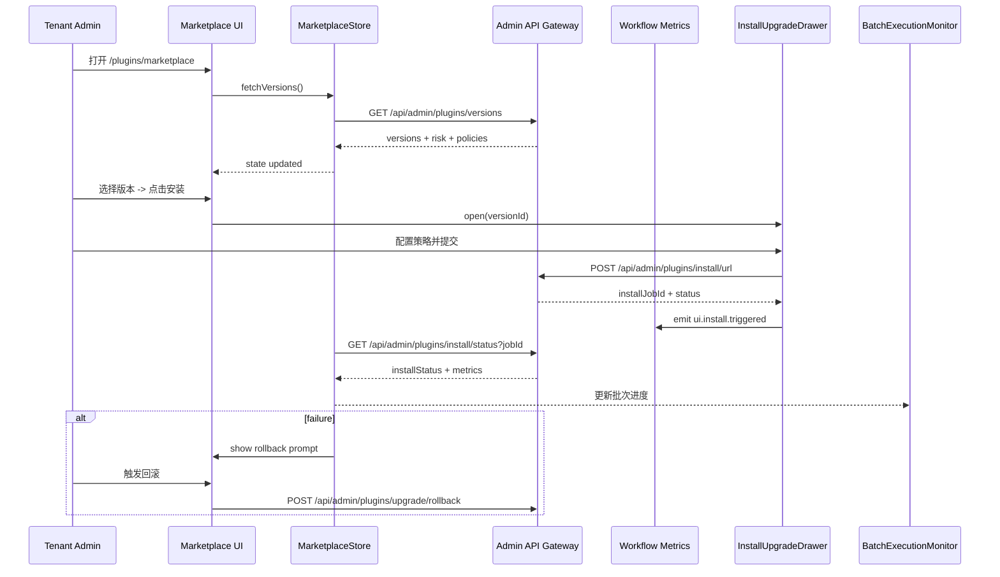

doc_id: PX-PUBLISH-ONLINE-UI-001
scn_id: SCN-PUBLISH-HUB-001
title: PX-PUBLISH-ONLINE-UI-001 - ui/marketplace
status: Draft
version: v0.1.0
repo_key: powerx
scope: powerx
layer: ui
domain: marketplace
scenario_title: "PowerX 插件开发与分发全链路"
owners:
  - name: Michael Hu
    role: Tech Steward
    contact: tech@artisan-cloud.com
  - name: Matrix-X
    role: Docs Coordinator
    contact: dev@artisan-cloud.com
contributors:
  - name: Chen Yao
    role: Admin UX Lead
    contact: chen.yao@artisan-cloud.com
  - name: Li Wei
    role: Frontend Engineer
    contact: li.wei@artisan-cloud.com
linked_requirements:
  - type: scenario
    ref: SCN-PUBLISH-HUB-001
  - type: scenario
    ref: SCN-PUBLISH-ONLINE-001
code_refs:
  - component: marketplace_dashboard_page
    path: web-admin/src/pages/plugins/marketplace/index.vue
    description: 展示在线插件目录、版本详情与操作面板
  - component: install_upgrade_drawer
    path: web-admin/src/components/plugins/marketplace/InstallUpgradeDrawer.vue
    description: 处理安装/升级表单、策略选择与确认流程
  - component: batch_execution_monitor
    path: web-admin/src/components/plugins/marketplace/BatchExecutionMonitor.vue
    description: 可视化升级批次、进度、失败回滚与告警
feature_flags:
  - name: PX_MARKETPLACE_UI
    description: 控制 Marketplace 在线发布 UI 是否对管理员开放
    default: false
    environments: [staging, production]
  - name: PX_AUTO_UPGRADE_UI
    description: 启用自动升级策略配置与批次监控功能
    default: false
    environments: [staging, production]
last_reviewed_at: 2025-10-28

---

# Usecase Overview

- **业务目标**：为租户管理员、平台运维提供统一的在线插件查看、安装、升级、回滚与告警界面，提升发布效率与可观测性。
- **成功度量**：安装/升级触发流程 ≤ 4 步；操作成功率 ≥ 98%；关键指标刷新延迟 ≤ 5s；P95 页面首屏渲染 < 2s。
- **场景关联**：消费 `MKP-PUBLISH-ONLINE-001` 上架版本与 `PX-PUBLISH-ONLINE-001` 的服务状态，支撑场景 Stage 3-4 的管理员交互。

Admin Marketplace UI 将 Marketplace 版本与 Core 安装能力整合到一个控制面板，提供版本筛选、风险提示、安装/升级向导、批次监控与故障应对入口。

# Context & Assumptions

- **前置条件**
  - Feature Flags `PX_MARKETPLACE_UI=1` 与 `PX_AUTO_UPGRADE_UI` 在目标环境启用。
  - 后端 API (`GET /api/admin/plugins/versions`, `POST /install/url`, `GET /upgrade/batches` 等) 已实现并稳定。
  - Admin 用户具备 `admin.plugins.marketplace`、`admin.plugins.install` 权限。
  - Nuxt/Nitro 环境配置可访问 Telemetry、通知、权限服务；全局国际化与深色模式已启用。
- **输入**
  - Marketplace 与 Core 提供的版本元数据、风险标签、安装状态。
  - 用户操作：筛选、安装、升级、暂停批次、回滚。
  - Telemetry 事件、告警、审计日志。
- **输出**
  - 可视化的版本目录、风险提示、自动升级策略、批次执行进度。
  - 操作反馈：Toast、弹窗、审计 ID、告警链接。
  - 引导文档与 SOP 链接。
- **边界**
  - 不包含 Marketplace 审核或插件上架流程（由 Marketplace UI 处理）。
  - 不管理离线包导入（由 Offline UI Usecase Cover）。
  - 不负责核心安装逻辑（由服务层 Usecase 提供 API）。

# Solution Blueprint

## 体系分解

| 模块 | Scope | 职责 | 代码入口 / Host |
|------|-------|------|-----------------|
| MarketplaceDashboardPage | powerx | 主页面展示版本列表、筛选、风险提示 | `web-admin/src/pages/plugins/marketplace/index.vue` |
| VersionDetailPanel | powerx | 展示版本元数据、依赖、变更日志、风险标签 | `web-admin/src/components/plugins/marketplace/VersionDetailPanel.vue` |
| InstallUpgradeDrawer | powerx | 安装/升级向导、策略选择、表单验证、确认提示 | `web-admin/src/components/plugins/marketplace/InstallUpgradeDrawer.vue` |
| BatchExecutionMonitor | powerx | 展示自动升级批次、进度、失败情况 | `web-admin/src/components/plugins/marketplace/BatchExecutionMonitor.vue` |
| RiskBadge & Alerts | powerx | 风险等级指示、告警信息、回滚入口 | `web-admin/src/components/plugins/marketplace/RiskBadge.vue` |
| MarketplaceStore | powerx | Vue state 管理版本、批次、安装状态、权限位 | `web-admin/src/stores/marketplaceStore.ts` |
| ApiClient | powerx | 封装 Admin API 调用、错误处理、重试策略 | `web-admin/src/services/plugins/marketplaceApi.ts` |

## 流程与时序

# Contracts & Interfaces

- **Inbound UI 交互**
  - 路由 `GET /plugins/marketplace` — 版本目录主页。
  - 抽屉 `InstallUpgradeDrawer` — 触发 install/upgrade API。
  - `BatchExecutionMonitor` — 调用批次状态 API，支持暂停/恢复/回滚按钮。
- **API 调用**
  - `GET /api/admin/plugins/versions` — 获取版本目录、兼容性、风险、租户可见性。
  - `POST /api/admin/plugins/install/url` — 发起安装，body 包含 `tenantId`, `versionId`, `strategy`, `notes`。
  - `GET /api/admin/plugins/upgrade/batches` — 查询批次与进度。
  - `POST /api/admin/plugins/upgrade/rollback` — 回滚失败批次。
  - `GET /api/admin/plugins/install/logs` — 下载安装日志、审计记录。
- **配置与脚本**
  - `PX_MARKETPLACE_UI_ALLOWED_ROLES` — 控制可访问角色。
  - `PX_MARKETPLACE_UI_METRICS_REFRESH_MS` — 指标轮询频率。
  - `PX_MARKETPLACE_UI_MAX_STREAM_ITEMS` — 实时日志/事件显示限制。
  - `scripts/plugins/marketplace/export-batch-report.ts` — 导出批次执行报告。

# Implementation Checklist

| 项目 | 描述 | 完成状态 | 负责人 |
|------|------|----------|--------|
| 页面框架 | 构建 Marketplace 列表、版本详情、响应式布局 | [ ] | Frontend Team |
| 安装/升级向导 | 实现策略配置、表单校验、确认提示、权限控制 | [ ] | Frontend Team |
| 批次监控 | 可视化批次进度、失败统计，支持暂停/回滚操作 | [ ] | Frontend Team |
| 状态管理 | 管理版本、批次、安装状态、权限；整合 API 调用 | [ ] | Frontend Team |
| 告警 & 反馈 | 实现风险提醒、通知入口、日志查看、回滚引导 | [ ] | Ops UX Team |
| 文档 & 培训 | 更新管理员操作手册、FAQ、告警处理流程 | [ ] | Docs Steward Team |

# Testing Strategy

- **单元测试**：`MarketplaceDashboard.spec.ts` 覆盖筛选与状态渲染；`InstallUpgradeDrawer.spec.ts` 验证表单校验与 API 调用；`BatchExecutionMonitor.spec.ts` 模拟批次更新与回滚。
- **集成测试**：使用 Cypress/Vitest 与 Mock API 运行 `pnpm test:ui --filter marketplace-install`，验证版本→安装→批次流程。
- **端到端测试**：结合真实后端或 Sandbox，演练管理员从查看版本到执行升级、回滚的完整流程。
- **非功能测试**：弱网情况下的加载与重试、批量通知负载、可访问性（WCAG AA）、深浅色模式视觉、国际化切换。

# Observability & Ops

- **指标**：`ui.marketplace.page_load_ms`, `ui.marketplace.install.click_through_rate`, `ui.marketplace.batch.success_rate`, `ui.marketplace.alert.dismiss_rate`.
- **日志**：前端埋点记录 `action`, `versionId`, `tenantScope`, `result`, `duration`; 错误上报至 Sentry。
- **告警**：安装触发但 5 分钟无结果、自动升级失败未处理、批次暂停超过 SLA 触发告警；UI 内展示并推送到 `#powerx-admin-alerts`。
- **Dashboards**：前端性能仪表板、管理员操作漏斗、批次执行热力图、告警处理状态面板。

# Rollback & Failure Handling

- **回滚步骤**：通过 Feature Flag 隐藏 Marketplace UI；回滚 web-admin 发布版本；清理缓存并重载页面。
- **补救措施**：提供 CLI 指南 (`px plugins install --tenant <id> --version <id>`)、导出安装请求、引导管理员联系 Ops；UI 显示快速链接到 runbook。
- **数据修复**：当 UI 状态与后端不一致时，触发强制刷新 API；如批次状态异常，调用后端重建批次或手动调整数据库，并在 UI 中提示。

# Risks & Mitigations

| 风险/事项 | 影响 | 缓解方案 | 负责人 | ETA |
|-----------|------|----------|--------|-----|
| 批次可视化与后端状态不同步 | 管理员误判进度 | 引入 SSE/轮询回退、手动刷新、指标对齐 | Frontend Team | 2025-02-01 |
| 风险提示被忽略 | 上线风险增加 | 强制确认弹窗、加入审批链、突出风险徽标 | Admin UX Lead | 2025-01-25 |
| 弱网下操作失败 | 安装成功率降低 | 加入重试、离线提示、自动保存草稿 | Frontend Team | 2025-02-10 |
| 告警噪声过高 | 运营疲劳 | 支持告警分级、批量确认、阈值配置 | Ops UX Team | 2025-02-05 |

# References & Links

- 场景文档：`docs/scenarios/publish/SCN-PUBLISH-ONLINE-001.md`
- 后端服务：`docs/usecases-seeds/SCN-PUBLISH-HUB-001/PX-PUBLISH-ONLINE-001.md`
- Marketplace 审核：`docs/usecases-seeds/SCN-PUBLISH-HUB-001/MKP-PUBLISH-ONLINE-001.md`
- 管理员手册：`docs/guides/publish/online.md`

> Seed 更新后，请执行 `npm run publish:usecases -- --scn-id SCN-PUBLISH-HUB-001 --validate-only` 完成校验，并安排一次管理员走查演练确认 UI 流程。
