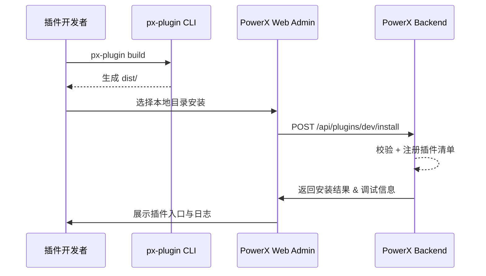

scn_id: SCN-DEV-HOTLOAD-001
title: 插件本地调试与热加载场景
status: Draft
version: v0.1.0
owners:
  - name: Michael Hu
    role: Plugin Tech Lead
    contact: tech@artisan-cloud.com
domains: [dev]
layers: [proto, service, ui]
repos:
  - key: powerx-plugin
    scope: powerx-plugin
    responsibility: 插件项目模板、构建与调试 CLI
  - key: powerx
    scope: powerx
    responsibility: 插件运行时、API、日志以及 Web Admin 热加载入口
related_usecases:
  - doc_id: PLG-DEV-HOTLOAD-001
    layer: proto
    domain: dev
  - doc_id: PX-DEV-HOTLOAD-001
    layer: service
    domain: dev
  - doc_id: PX-DEV-HOTLOAD-UI-001
    layer: ui
    domain: dev
last_reviewed_at: 2025-01-01

---

# Executive Summary

本场景覆盖插件开发者在本地环境完成构建、安装与热加载的全流程，目标是在不依赖 Marketplace 的前提下快速验证插件功能、接口与权限配置。成功执行后，开发者可在 PowerX Web Admin 中即时体验插件效果，并循环迭代。

# Scope & Guardrails

- **In Scope**：插件源码构建、产物安装、后端注册、Admin 页面热加载与卸载。
- **Out of Scope**：Marketplace 审核、版本签名、跨租户分发、线上回滚策略。
- **Environment & Flags**：需要启用 `PX_PLUGIN_DEV_MODE`；本地 Core/Admin 与插件工程需联网或共享本地文件系统；插件仓必须通过 SDK 校验。

# Participants & Responsibilities

| Scope               | Repository    | Layer   | 责任与交付物                                       | Owners                      |
|---------------------|---------------|---------|----------------------------------------------------|-----------------------------|
| PowerXPlugin        | powerx-plugin | proto   | 提供 CLI、开发模板、构建输出                       | Michael Hu（Plugin Tech Lead） |
| PowerX (Core+Admin) | powerx        | service | 注册插件、暴露调试 API、记录日志、热加载界面与反馈 | Carol（Platform Lead）      |

# End-to-End Flow

1. **Stage 1 – 本地构建**：开发者在插件工程执行 `px-plugin build`，生成 `dist/` 或 `.pxp` 目录。
2. **Stage 2 – 连接 Admin**：登录 PowerX Web Admin，在插件管理页选择“本地目录安装”。
3. **Stage 3 – 热加载执行**：Admin 调用 Backend 的 `POST /api/plugins/dev/install` 接口，复制产物并完成依赖注入。
4. **Stage 4 – 调试迭代**：开发者在 Admin 中查看插件入口，配合 CLI `px-plugin dev --watch` 实现热更新；日志与错误通过 Backend 返回。

# Key Interactions & Contracts

- **APIs / Events**：`POST /api/plugins/dev/install`、`DELETE /api/plugins/dev/install`、WebSocket `plugin.dev.logs`。
- **Configs / Schemas**：本地 `manifest.json`、调试权限策略 YAML。
- **Security / Compliance**：仅允许拥有 `plugin:dev` 权限的开发者操作；日志保留 7 天便于审计。

# Usecase Links

- `PLG-DEV-HOTLOAD-001` — 插件工程生成热加载产物（proto 层）。
- `PX-DEV-HOTLOAD-001` — Backend 注册与生命周期管理（service 层）。
- `PX-DEV-HOTLOAD-UI-001` — Admin 热加载界面与提示（ui 层）。

# Acceptance Criteria

1. 从构建产物到 Admin 成功加载的耗时不超过 2 分钟。
2. 热加载失败时自动回滚到上一个稳定版本并提示原因。
3. 调试模式下的操作日志在 CLI 与 Admin 均可实时查看。

# Telemetry & Ops

- 指标：`plugin.dev.install.duration`、`plugin.dev.install.success_rate`、`plugin.dev.rollback.count`。
- 告警阈值：连续两次安装失败、成功率低于 95%。
- 观测来源：Prometheus 指标、Admin 调试日志、CLI 实时输出。

# Open Issues & Follow-ups

| 风险/事项                             | 影响范围        | 负责人            | ETA        |
|---------------------------------------|-----------------|-------------------|------------|
| CLI 与 Admin 日志对齐策略待补齐       | 调试效率        | Matrix-X（Docs Coordinator） | 2025-02-10 |
| 插件依赖冲突自动检测能力不足         | 插件运行稳定性  | Michael Hu（Plugin Tech Lead） | 2025-03-05 |

# Appendix

- Dev 热加载 API 设计稿：<https://docs.artisancloud.com/powerx/dev-hotload>
- CLI 热加载调试指南：`docs/guides/dev/hotload-debug.md`
