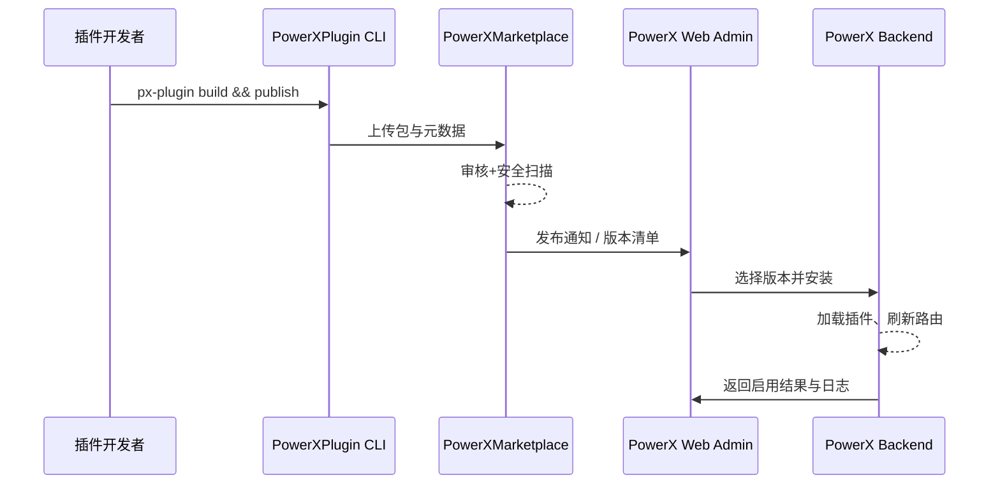

scn_id: SCN-PUBLISH-HUB-001
title: PowerX 插件生态发布枢纽场景
status: Draft
version: v0.1.0
owners:

- name: Matrix-X
    role: Product Manager
    contact: <tech@artisan-cloud.com>
domains: [publish]
layers: [business]
repos:
- key: powerx-plugin
    scope: powerx-plugin
    responsibility: 插件开发、打包与发布 CLI
- key: powerx
    scope: powerx
    responsibility: 插件运行时、权限隔离、事件日志，以及 Web Admin 安装与回滚入口
- key: powerx-marketplace
    scope: powerx-marketplace
    responsibility: 插件审核、上架与分发
related_usecases:
- doc_id: SCN-DEV-HOTLOAD-001
    layer: scenario
    domain: dev
- doc_id: SCN-PUBLISH-OFFLINE-001
    layer: scenario
    domain: publish
- doc_id: SCN-PUBLISH-ONLINE-001
    layer: scenario
    domain: publish
last_reviewed_at: 2025-01-01

---

# Executive Summary

PowerX 插件生态发布枢纽（Publish Hub）连接了插件开发、审核与分发的全链路。该场景确保开发团队可以在统一流程中完成插件构建、市场发布以及在各 PowerX 实例中的同步启用。目标是让插件生命周期从本地调试到线上生态发布的每个环节都可审计、可回滚、可复用。

# Scope & Guardrails

- **In Scope**：插件构建、元数据收集、审核排期、发布审批、版本同步、回滚策略。
- **Out of Scope**：插件具体业务能力实现、第三方支付结算、非 PowerX 平台的分发渠道。
- **Environment & Flags**：依赖 `PX_PLUGIN_HUB_ENABLED` Feature Flag；Marketplace 与 Core 环境需保持版本兼容；审核运营团队在管理后台具备审批权限。

# Participants & Responsibilities

| Scope                | Repository         | Layer    | 责任与交付物                                       | Owners             |
|----------------------|--------------------|----------|----------------------------------------------------|--------------------|
| PowerXPlugin         | powerx-plugin      | dev      | 插件项目模板、构建脚本、签名流程                   | TODO_ASSIGN_OWNER |
| PowerX (Core+Admin)  | powerx             | platform | 插件运行时加载、权限隔离、事件日志、安装/回滚界面 | TODO_ASSIGN_OWNER |
| PowerX Marketplace   | powerx-marketplace | market   | 插件审核工作流、上架发布、版本控制                 | TODO_ASSIGN_OWNER |

# End-to-End Flow

1. **Stage 1 – 提交版本候选**：开发者在 PowerXPlugin 仓执行构建，生成 `.pxp` 包并上传元数据。
2. **Stage 2 – Marketplace 审核**：运营团队收到发布申请，进行自动化扫描与人工审批，确定可上架版本。
3. **Stage 3 – 发布同步**：审核通过后，版本元数据同步至 Publish Hub，触发各租户的订阅通知与升级提示。
4. **Stage 4 – 安装与启用**：租户管理员在 PowerX Web Admin 中选择目标版本，通过 `install/local`（离线包）或 `install/url`（远程包）接口完成安装、灰度与回滚。

# Key Interactions & Contracts

- **APIs / Events**：
  - `POST /api/marketplace/plugins`：提交插件包与元数据。
  - `POST /{{api_prefix}}/admin/plugins/install/local`：在租户后台上传 `.pxp` 包并本地安装。
  - `POST /{{api_prefix}}/admin/plugins/install/url`：由 Core 从远程地址拉取包体并安装。
  - `Event: ":plugin.publish.approved`：发布成功后广播给订阅系统。"
- **Configs / Schemas**：插件 `manifest.json`、Marketplace 审核策略 YAML。
- **Security / Compliance**：插件签名校验、租户隔离、发布审批日志留存 180 天。

# Usecase Links

- `TODO_DOC_ID` — TODO_说明（publish 层，自有仓路径）

# Acceptance Criteria

1. 发布申请需在 2 个工作日内完成审核与反馈。
2. 审核通过的插件版本可以在 30 分钟内同步至所有订阅租户。
3. 任意安装失败都可在 5 分钟内回滚到上一版本，并自动生成告警。

# Telemetry & Ops

- 指标：`plugin_release.hotload.latency_ms`, `plugin_release.pipeline.duration_seconds`, `plugin_release.canary.rollback_seconds`, `plugin_release.distribution.sla_seconds`。
- 告警阈值：审批超过 SLA、安装成功率低于 95%、发生连续两次回滚。
- 观测来源：Grafana 仪表板、Marketplace 审核日志、PowerX Web Admin 事件流。

# Open Issues & Follow-ups

| 风险/事项                               | 影响范围              | 负责人                | ETA        |
|-----------------------------------------|-----------------------|-----------------------|------------|
| 插件安全扫描自动化覆盖率需提升到 90%    | 审核流程、发布时效    | 李卓（Marketplace QA） | 2025-02-15 |
| 订阅租户批量回滚策略尚未固化           | 多租户运营            | 郑宁（Ops Lead）       | 2025-03-01 |

# Appendix

- 发布流程改造 PR：<https://gitlab.artisancloud.com/powerx/publish/-/merge_requests/214>
- 生态发布白板文档：<https://docs.artisancloud.com/powerx/publish-hub>
- 版本路标：2025H1 插件生态提升计划
