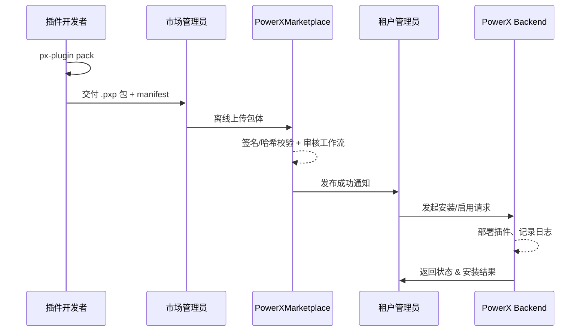

scn_id: SCN-PUBLISH-OFFLINE-001
title: 插件离线打包与上传发布场景
status: Draft
version: v0.1.0
owners:
  - name: Michael Hu
    role: Product Manager
    contact: matrix-x@artisan-cloud.com
domains: [publish]
layers: [proto, service, ui, api]
repos:
  - key: powerx-plugin
    scope: powerx-plugin
    responsibility: 插件打包、校验工具
  - key: powerx-marketplace
    scope: powerx-marketplace
    responsibility: 离线上传、元数据注册、审核工作流
  - key: powerx
    scope: powerx
    responsibility: 安装执行、回滚、日志以及 Web Admin 版本管理
related_usecases:
  - doc_id: PLG-PUBLISH-OFFLINE-001
    layer: proto
    domain: publish
  - doc_id: MKP-PUBLISH-OFFLINE-001
    layer: api
    domain: marketplace
  - doc_id: PX-PUBLISH-OFFLINE-001
    layer: service
    domain: publish
  - doc_id: PX-PUBLISH-OFFLINE-UI-001
    layer: ui
    domain: publish
last_reviewed_at: 2025-01-01

---

# Executive Summary

该场景面向无法访问公网或需要人工审核的企业环境。开发者将插件打包为离线文件，由运维或管理员通过 Marketplace 后台手动上传、审核并分发。流程确保在离线或半离线场景下也能安全引入插件，同时保留审计链路。

# Scope & Guardrails

- **In Scope**：插件打包、离线上传、审核审批、安装分发、回滚策略。
- **Out of Scope**：在线自动发布、跨租户自动同步、第三方 Marketplace 接入。
- **Environment & Flags**：需要启用 `PX_MARKET_OFFLINE_UPLOAD`；运维账号具备 `marketplace: "offline_upload` 权限；插件包需通过签名与哈希校验。"

# Participants & Responsibilities

| Scope               | Repository         | Layer  | 责任与交付物                                         | Owners                              |
|---------------------|--------------------|--------|------------------------------------------------------|-------------------------------------|
| PowerXPlugin        | powerx-plugin      | proto  | 打包脚本、`.pxp` 格式定义、校验工具                 | Michael Hu（Plugin Tech Lead）      |
| PowerX Marketplace  | powerx-marketplace | api    | 离线上传接口、审核工作流、仓储                       | Li Zhu（Marketplace PM）            |
| PowerX (Core+Admin) | powerx             | service| 安装执行、回滚机制、状态推送、插件列表展示与操作入口 | Carol（Platform Lead）              |

# End-to-End Flow

1. **Stage 1 – 打包校验**：开发者运行 `px-plugin pack` 生成 `.pxp` 包，并输出 `manifest.json` 与签名摘要。
2. **Stage 2 – 离线上传**：管理员在 Marketplace 控制台选择“离线上传”，提交包体与元数据，系统执行哈希/签名校验。
3. **Stage 3 – 审核入库**：运营团队审核插件信息，标记版本状态；审核通过后生成内部版本号并存档。
4. **Stage 4 – 安装启用**：租户管理员在 PowerX Web Admin 内选择该版本，通过 `POST /{{api_prefix}}/admin/plugins/install/local` 导入离线包并验证功能，必要时可回滚。

# Key Interactions & Contracts

- **APIs / Events**：`POST /api/marketplace/plugins/offline-upload`、`POST /{{api_prefix}}/admin/plugins/install/local`、`Event: ":plugin.offline.approved`。"
- **Configs / Schemas**：插件 `manifest.json`、离线审核 checklist、签名策略。
- **Security / Compliance**：离线包需双人审批；所有上传和审批动作写入审计日志；插件包必须由官方或受信 CA 签名。

# Usecase Links

- `PLG-PUBLISH-OFFLINE-001` — 插件打包与签名流程。
- `MKP-PUBLISH-OFFLINE-001` — Marketplace 离线上传与审核。
- `PX-PUBLISH-OFFLINE-001` — Backend 安装与回滚。
- `PX-PUBLISH-OFFLINE-UI-001` — Admin 插件管理界面。

# Acceptance Criteria

1. 离线上传与审核在 1 个工作日内完成，失败原因需明确反馈。
2. 插件安装成功率 ≥ 98%，失败时支持一键回滚。
3. 每个离线包上传、审核、安装均有可追溯日志与审批记录。

# Telemetry & Ops

- 指标：`plugin.offline.upload.count`、`plugin.offline.approval.duration`、`plugin.offline.install.success_rate`。
- 告警阈值：审批逾期、安装失败率超过 5%、未验证签名。
- 观测来源：Marketplace 审核日志、Admin 操作审计、Prometheus 指标。

# Open Issues & Follow-ups

| 风险/事项                                     | 影响范围        | 负责人            | ETA        |
|-----------------------------------------------|-----------------|-------------------|------------|
| 离线包加密与传输规范待完善                     | 安全合规        | Zheng Ning（Ops Lead）   | 2025-02-28 |
| 批量安装脚本需支持多租户同时更新               | 运营效率        | Carol（Platform Lead）    | 2025-03-15 |

# Appendix

- 离线上传操作手册与审核流程：`docs/guides/admin/offline-upload.md`
- 离线包签名工具示例：<https://docs.artisancloud.com/powerx/plugin-offline-kit>
