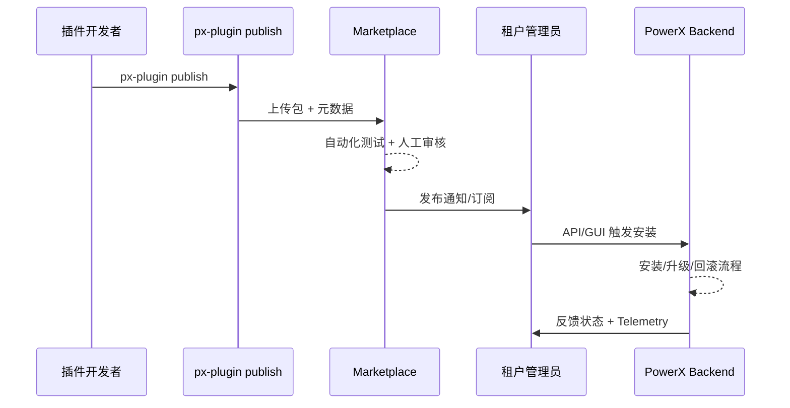

scn_id: SCN-PUBLISH-ONLINE-001
title: 插件在线发布与Marketplace分发场景
status: Draft
version: v0.1.0
owners:
  - name: Michael Hu
    role: Product Manager
    contact: matrix-x@artisan-cloud.com
domains: [publish]
layers: [proto, service, api, ui]
repos:
  - key: powerx-plugin
    scope: powerx-plugin
    responsibility: 插件发布 CLI、版本元数据
  - key: powerx-marketplace
    scope: powerx-marketplace
    responsibility: 在线审核、上架、订阅推送
  - key: powerx
    scope: powerx
    responsibility: 安装、升级、回滚 API 以及 Web Admin 管理界面
related_usecases:
  - doc_id: PLG-PUBLISH-ONLINE-001
    layer: proto
    domain: publish
  - doc_id: MKP-PUBLISH-ONLINE-001
    layer: api
    domain: marketplace
  - doc_id: PX-PUBLISH-ONLINE-001
    layer: service
    domain: catalog
  - doc_id: PX-PUBLISH-ONLINE-UI-001
    layer: ui
    domain: marketplace
last_reviewed_at: 2025-01-01

---

# Executive Summary

在线发布场景保证插件作者可以直接把版本推送到 PowerX Marketplace，由市场自动完成审核、上架、通知及多租户分发。该流程适合正式生态发布，具备标准化的版本控制、签名校验与回滚策略，帮助生态参与者快速获取最新插件能力。

# Scope & Guardrails

- **In Scope**：在线构建与 publish、Marketplace 审核审批、版本签名、通知订阅、自动化安装推送。
- **Out of Scope**：离线或私有分发、Marketplace 之外的渠道、第三方支付结算。
- **Environment & Flags**：需启用 `PX_MARKET_PUBLISH_ENABLED`；使用 `px-plugin publish` 或 Marketplace UI 均需具备 `plugin:publish` 权限；版本签名与依赖清单必须完整。

# Participants & Responsibilities

| Scope               | Repository         | Layer   | 责任与交付物                                       | Owners                              |
|---------------------|--------------------|---------|----------------------------------------------------|-------------------------------------|
| PowerXPlugin        | powerx-plugin      | proto   | 提供 `publish` 命令、版本元数据管理               | Michael Hu（Plugin Tech Lead）      |
| PowerX Marketplace  | powerx-marketplace | api     | 审核流、自动化测试、上架与订阅推送                 | Li Zhu（Marketplace PM）            |
| PowerX (Core+Admin) | powerx             | service | 安装/升级 API、自动化回滚、插件管理 UI 与告警展示 | Zheng Ning（Ops Lead）              |

# End-to-End Flow

1. **Stage 1 – 发布准备**：开发者在本地构建并运行 `px-plugin publish`，CLI 收集 manifest、依赖、签名信息，并上传至 Marketplace。
2. **Stage 2 – 审核与自动化验证**：Marketplace 触发安全扫描、兼容性测试和人工审核，生成审核报告。
3. **Stage 3 – 上架与通知**：审核通过后，版本在 Marketplace 上架，并向订阅租户发送通知；可配置自动升级或人工选择。
4. **Stage 4 – 安装与运营**：租户通过 PowerX Web Admin 或 API 选择版本安装，调用 `POST /{{api_prefix}}/admin/plugins/install/url` 拉取远程包体；安装完成后记录日志、可随时回滚。

# Key Interactions & Contracts

- **APIs / Events**：`POST /api/marketplace/plugins/publish`、`Event::plugin.publish.approved`、`POST /{{api_prefix}}/admin/plugins/install/url`。
- **Configs / Schemas**：`manifest.json`、依赖图、签名证书、自动升级策略。
- **Security / Compliance**：发布者身份校验；版本签名强制；所有审核结果与操作保留 180 天；支持多租户隔离策略。

# Usecase Links

- `PLG-PUBLISH-ONLINE-001` — CLI 发布流程。
- `MKP-PUBLISH-ONLINE-001` — Marketplace 审核与上架。
- `PX-PUBLISH-ONLINE-001` — Backend 安装与升级。
- `PX-PUBLISH-ONLINE-UI-001` — Admin 插件管理体验。

# Acceptance Criteria

1. 发布到审核通过的平均时长 ≤ 4 小时，超出 SLA 自动告警。
2. 插件上线后 99% 的租户可在 30 分钟内获取通知并安装。
3. 安装失败能够在 5 分钟内自动回滚，并向发布者与租户推送告警。

# Telemetry & Ops

- 指标：`plugin.online.publish.count`、`plugin.online.approval.duration`、`plugin.online.install.success_rate`。
- 告警阈值：审批超 SLA、安装成功率 < 98%、回滚次数异常。
- 观测来源：Marketplace 审核日志、PowerX Backend 指标、Admin 告警面板。

# Open Issues & Follow-ups

| 风险/事项                           | 影响范围        | 负责人            | ETA        |
|-------------------------------------|-----------------|-------------------|------------|
| 自动化测试覆盖率需扩展至新审核流程   | 审核效率与质量  | Li Zhu（Marketplace QA） | 2025-02-20 |
| 租户端自动升级策略配置需完善         | 租户运营体验    | Zheng Ning（Ops Lead）   | 2025-03-10 |

# Appendix

- Marketplace 在线发布操作手册：`docs/guides/publish/online.md`
- 审核策略与自动化测试模板：<https://docs.artisancloud.com/powerx/marketplace/review-playbook>
