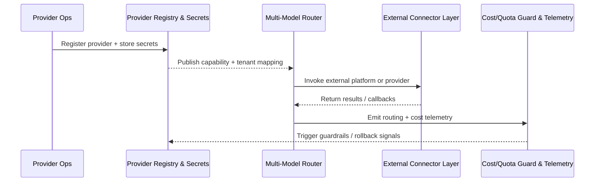

# Feature Specification: Agent Model Hub Connectivity & Governance

**Feature Branch**: `[010-agent-model-setting]`  
**Created**: 2025-11-09  
**Status**: Draft  
**Input**: User description: "请根据docs/use_cases/_from_hub/SCN-AGENT-MODEL-HUB-001目录下的所有需求场景文档，来实现相关的spec文档"

## User Scenarios & Testing *(mandatory)*

### User Story 1 - Provider Ops completes governed onboarding (Priority: P1)

PowerX Provider Operations staff register a new model provider, store credentials, run automated health checks, and roll it out to target tenants within 24 hours while retaining rollback coverage.

**Why this priority**: Without a predictable onboarding pipeline, no downstream routing, governance, or connector can rely on trusted providers, blocking all value.

**Independent Test**: Trigger onboarding for a sandbox provider using registry API/CLI and verify that configuration, secret storage, validation, and staged rollout succeed end-to-end without touching routing or connectors.

**Acceptance Scenarios**:

1. **Given** a provider admin has collected metadata, contact info, end points, tenant lists, budgets, and credentials, **When** they submit `POST /internal/providers/register`, **Then** the system writes a draft YAML config, encrypts secrets, schedules rotation, and records an audit entry within 5 minutes.
2. **Given** automated validation detects latency, auth, or quota issues for that provider, **When** the health score falls below the approval threshold, **Then** onboarding is blocked from publishing to any tenant, a failure report is surfaced, and the previous stable provider set remains untouched.

---

### User Story 2 - Routing owner ships adaptive multi-model policies (Priority: P2)

A routing policy owner authorizes and debugs policies that select primary and fallback models per tenant/task, can simulate expected hit rates, and can roll back within five minutes when telemetry flags regressions.

**Why this priority**: Accurate routing drives the ≥90% hit rate KPI and prevents outages when a provider degrades, making it the next most critical slice after onboarding.

**Independent Test**: Update a routing YAML policy, run the simulator against fixture tasks, and promote the new version to a gray release while verifying telemetry-driven safe-mode triggers without touching cost or connectors.

**Acceptance Scenarios**:

1. **Given** a policy author uploads a new routing template with weighted providers and SLA guardrails, **When** they request publication, **Then** the policy version is validated, records the business-unit-defined approval outcome, and is deployed to selected tenants with traceable version IDs.
2. **Given** telemetry detects a 10% drop in hit rate or a provider incident, **When** safe-mode is triggered, **Then** the router automatically pivots to fallback models, logs the event, and offers a one-click rollback that restores the prior policy within five minutes.

---

### User Story 3 - FinOps and Ops teams enforce cost & quota guardrails (Priority: P3)

FinOps analysts and on-call engineers monitor live cost and usage, are alerted to anomalies within five minutes, and can enforce throttles or degradations that automatically recover when conditions normalize.

**Why this priority**: Budget adherence and quota enforcement prevent runaway costs and contractual breaches while giving routing and connectors trusted guard signals.

**Independent Test**: Replay synthetic usage data through the metering pipeline to trigger an anomaly, verify alerts reach on-call teams, and observe quota enforcement automatically throttling affected tenants with audit trails.

**Acceptance Scenarios**:

1. **Given** real-time metering ingests tenant/provider usage, **When** spend exceeds 110% of the configured threshold for that window, **Then** an `agent.provider.cost.anomaly` event fires, paging ops, and the console surfaces recommended throttle/degrade options that require an operator to confirm before execution.
2. **Given** an operator invokes quota enforcement with a degrade action, **When** the action completes, **Then** the impacted tenant’s requests are rate-limited or rerouted to low-cost models, and an audit + recovery timer is stored for automatic rollback within 15 minutes of stabilization.

---

### User Story 4 - Connector owners bridge external agent platforms safely (Priority: P4)

Connector maintainers integrate Coze or n8n workspaces so the primary agent can invoke them with signed callbacks, consistent context mapping, and governed degradation when the platform is unstable.

**Why this priority**: External platforms expand available automations but introduce security risk; governed connectors keep the ecosystem compliant without blocking higher-priority flows.

**Independent Test**: Register a Coze workspace, complete OAuth handshake, run an invocation that returns via signed webhook, and simulate callback failures to confirm retries and degradation happen without impacting internal routing.

**Acceptance Scenarios**:

1. **Given** a connector owner registers a platform instance with OAuth tokens and mapping rules, **When** they deploy it, **Then** the system stores only encrypted tokens, validates callback signatures, and exposes the connector to tenant-scoped routing policies.
2. **Given** webhook verification fails or the platform becomes unavailable, **When** the error rate crosses the 5% threshold for a specific connector instance, **Then** that instance auto-pauses new executions, retries pending callbacks with exponential backoff, and notifies the owning guild with trace IDs while other healthy instances remain available.

---

### Edge Cases

- Provider registration metadata is incomplete or contains mismatched tenant lists; onboarding must reject the submission with actionable errors without persisting partial secrets.
- Routing telemetry is unavailable for a region while safe-mode is active; decision engine must degrade gracefully using cached health scores for a bounded period.
- External platform callbacks arrive without signatures or outside the allowed timestamp drift; the system should drop them, emit audit logs, and keep the orchestrated task in a pending-review state.
- Cost ingestion lags longer than one minute; guardrails must mark data as stale, continue conservative throttling, and alert Ops about degraded visibility.

### Architecture Overview



## AI 模态驱动统一架构（补充）

### 现状问题
- LLM 驱动已迁移到 `backend/internal/server/ai/drivers/{provider}/llm.go`
- Embedding 驱动已迁移到 `backend/internal/server/ai/drivers/{provider}/embedding.go`
- 其他模态（image/video/tts/asr/model3d/VLM）缺少统一驱动层

导致：目录割裂、对外接口实现难以复用、驱动接入不一致。

### 目标目录结构（统一驱动入口）

> 驱动层不再依赖 `eino` 目录。按 **provider 维度**聚合，同一 provider 复用认证/HTTP 适配；不同模态仅做输入输出映射。

```
backend/internal/service/ai/                 # 对外统一服务层（invoke/session/stream）
backend/internal/server/ai/factory/          # 模态工厂/通用入口（LLM/VLM/Embedding/...)
backend/internal/server/ai/factory/
  llm/                                       # LLM 模态工厂 + 通用工具
  vlm/                                       # VLM 模态工厂 + 通用工具
backend/internal/server/ai/drivers/          # 统一驱动入口（按 provider 拆分）
  core/                                      # 共享 HTTP/Auth/Retry/RateLimit/签名
  openai/
    llm.go
    embedding.go
    image.go
    video.go
    tts.go
    asr.go
    vlm.go
  google/
    image.go        # Gemini Nano Banana (gemini-2.5-flash-image / gemini-3-pro-image-preview)
    vlm.go
  hunyuan/
    llm.go
    image.go
    video.go
  jimeng/
    image.go        # 即梦
    video.go
  qwen/
    llm.go
    vlm.go
    image.go
  comfyui/
    image.go
    video.go
  stable_diffusion/
    image.go
  coze/
    workflow.go
  ollama/
    llm.go
    embedding.go
backend/internal/server/agent/contracts/     # 模态输入输出结构（统一 DTO）
backend/internal/server/agent/registry/      # provider 注册、路由、capability 映射
```

### 服务层职责（统一入口）
- `service/ai` 负责：
  - 解析 `model_key` → provider/model
  - 读取租户 Profile（env + modality + provider + model）
  - 拼接 defaults/params
  - 调用统一 provider 驱动
  - 统一错误码与审计写入

### 驱动接口建议（按模态）
- LLM：`Invoke(ctx, config, prompt) -> text/stream`
- Embedding：`Embed(ctx, config, inputs[]) -> vectors`
- VLM（image+text -> text）：`Invoke(ctx, config, inputs, params) -> text/stream`
- Image/Video/TTS/ASR/Model3D：`Invoke(ctx, config, inputs, params) -> artifact`

### 模态与 Provider 覆盖矩阵（计划）

> 说明：此处为目标清单；实际实现需与 `drivers/{provider}` 对齐。

- **LLM**：OpenAI / Tencent Hunyuan / Qwen / Ollama / OpenAI-Compatible（OpenRouter、vLLM、DeepSeek、Moonshot、HF）
- **Embedding**：OpenAI / OpenAI-Compatible / Ollama / Baidu Qianfan / HuggingFace
- **VLM**：OpenAI / Google Gemini / Qwen / Tencent Hunyuan
- **Image**：OpenAI（图像系列）/ Google Gemini Nano Banana / 字节即梦 / Tencent Hunyuan / Qwen / ComfyUI / Stable Diffusion
- **Video**：OpenAI（Sora 系列）/ Google（Veo 系列）/ 字节即梦 / Tencent Hunyuan / ComfyUI
- **TTS/ASR**：OpenAI / Tencent / Qwen / 其他兼容 API（按 provider 适配）
- **Model3D**：Tencent Hunyuan / OpenAI-Compatible（若提供 HTTP 规范）/ 自研平台

### Provider / App / Model / Key 策略（统一约定）

**概念定义**
- **provider**：平台级供应商（OpenAI / volcengine / ollama / vllm）
- **app**：provider 内部的产品线或子平台（如 volcengine：即梦、Coze）
- **model**：具体模型能力（image/video/llm/vlm…）
- **provider_key / credential**：**仅用于鉴权**，provider 级别；同一 key 可访问该 provider 下所有 app & model
- **model_key**：**仅用于路由**，不承担鉴权

**model_key 格式**
- 无 app：`provider/model`
  - 例：`ollama/llama3:8b`、`vllm/qwen2.5:7b`
- 有 app：`provider/app:model`
  - 例：`volcengine/jimeng:image-v3`、`volcengine/jimeng:video-3.0-1080p`

**解析规则**
1) 先用 `/` 拆出 `provider` 与 `rest`  
2) 若 `rest` 命中 provider 配置的 `app` 列表 → 解析 `app + model`  
3) 否则 `app=""`，`model=rest`

**鉴权规则**
- 只按 provider 查 credential  
- app 与 model 不影响鉴权逻辑

**catalog / manifest 结构**
- provider 可选 `apps`
- 有 apps：`apps → modalities → models`
- 无 apps：`modalities → models`（保持向后兼容）

**driver 路由**
- 以 provider 为入口  
- `app` 为空 → 默认 provider driver  
- `app` 非空 → 走 app 子适配器（如 volcengine/jimeng）

### 迁移计划（分阶段）
1. **阶段 A（specs/007）**：接口打通（/ai/*，/agents/*），非核心模态返回 202 占位。
2. **阶段 B（specs/010）**：驱动统一迁移
   - 将现有 `eino/llm`、`intent/embed` 迁移到 `server/ai/providers/*`
   - 增加 image/video/tts/model3d 驱动实现
   - `service/ai` 统一调用（禁止直连散落逻辑）
3. **阶段 C**：删除旧入口与临时占位逻辑

### 多模态开发顺序（执行清单）
> 先确保 AI Settings 测试 & OpenAPI 可访问为准。
1. **Image（基础）**：OpenAI → Gemini Nano Banana → 即梦  
2. **Image（自托管）**：Stable Diffusion → ComfyUI  
3. **Video**：OpenAI Sora → Google Veo → 即梦  
4. **VLM**：OpenAI → Gemini → Qwen → Hunyuan  
5. **TTS/ASR/Model3D**：按业务优先级逐个补齐

## Requirements *(mandatory)*

### Functional Requirements

- **FR-001**: System MUST provide a governed provider onboarding workflow that captures metadata, capabilities, tenants, and budgets, and blocks publication until required fields are validated.
- **FR-002**: System MUST store all provider secrets and platform tokens in the managed secret store, enforce rotation schedules, and expose only references inside provider or connector configs.
- **FR-003**: System MUST execute automated health and capability validation for every new or updated provider and record pass/fail artifacts that gate rollout decisions.
- **FR-004**: System MUST support tenant-scoped rollout plans with staged, auditable publish and rollback commands that complete within five minutes.
- **FR-005**: System MUST offer a versioned routing policy store with schema validation, configurable approval workflows (per business unit), approval history, targeted gray releases, and one-click rollback.
- **FR-006**: System MUST generate per-request routing decisions within 200 ms using policy weights, live health signals, cost ceilings, and fallback chains, emitting trace IDs for observability.
- **FR-007**: System MUST monitor routing telemetry for hit rate, latency, and fallback success, and automatically trigger safe-mode or downgrade actions when thresholds are breached.
- **FR-008**: System MUST ingest real-time usage and cost metrics, compare them against configurable quotas, raise `agent.provider.cost.anomaly` events, and recommend enforcement actions within five minutes without auto-executing them.
- **FR-009**: System MUST allow authorized operators to confirm recommended throttling, degrade, or disable actions per tenant/provider combination from the console and automatically record audit entries plus recovery criteria once executed.
- **FR-010**: System MUST manage external platform connectors (e.g., Coze, n8n) with OAuth handshake, context mapping, request invocation, signed callback verification, and failure retries while allowing per-instance isolation during degradations.
- **FR-011**: System MUST expose consolidated observability—including onboarding status, routing health, connector availability, and cost guard state—so operators can correlate incidents quickly, and provide tenant-specific read-only dashboards covering their own routing outcomes, connector states, and cost/quota posture.

### Key Entities

- **Provider Profile**: Represents an onboarded model provider; includes capability tags, environment endpoints, tenant eligibility, health status, and secret references used by routing decisions.
- **Routing Policy**: A versioned set of rules linking task contexts to ranked providers, fallback chains, safe-mode toggles, and rollout metadata such as tenants, effective dates, and approvals.
- **Connector Instance**: Describes an external platform workspace with OAuth tokens, context mapping templates, webhook signing keys, rate limits, and owning guild metadata.
- **Cost & Quota Ledger**: Aggregates per-tenant/provider consumption, configured budgets, anomaly flags, enforcement actions, and audit trails that feed dashboards and alerts.

### Telemetry Alignment

- Provider onboarding & health: `agent.provider.onboard_duration`, `agent.provider.health_score`, `agent.provider.secret_rotation_total`.
- Routing quality & resiliency: `agent.routing.hit_rate`, `agent.routing.fallback_total`, `agent.routing.decision_latency`, `agent.routing.safe_mode_active`.
- Connector reliability: `agent.platform.latency_p95`, `agent.platform.callback_failure_total`, `agent.platform.degrade_total`.
- Cost & quota governance: `agent.provider.cost_total`, `agent.provider.quota_usage`, `agent.provider.cost_delta_percent`, `agent.provider.alert_total`.

## Success Criteria *(mandatory)*

### Measurable Outcomes

- **SC-001**: 95% of new providers progress from registration to tenant gray release within 24 hours with zero unencrypted secret exposures.
- **SC-002**: Multi-model routing maintains ≥90% hit rate and ≥95% fallback success across monitored tenants, with safe-mode rollbacks completing in ≤5 minutes.
- **SC-003**: External connector invocations achieve ≥98% success and maintain callback signature verification failures below 1% per day.
- **SC-004**: Cost and quota guardrails detect anomalies and deliver enforcement options within 5 minutes, limiting overspend exposure per tenant to <10% beyond configured budgets.
- **SC-005**: 100% of enforcement, rollout, and connector pause/resume actions produce traceable audit entries accessible within 1 minute of execution.

## Assumptions & Dependencies

- Vault/Secret Manager, Telemetry pipeline, Cost Warehouse, and Quota Service remain available with the SLAs referenced in the source use cases.
- Feature flags `model-provider-registry`, `multi-model-router`, `agent-platform-connectors`, and `provider-cost-guard` are already registered in the configuration service for controlled rollout.
- External platforms (Coze, n8n) expose stable OAuth and webhook contracts; any unsupported behavior requires new connectors that follow the same governance pattern.
- Planner/Orchestrator components will pass task context attributes (tenant, SLA tier, modality, budget) required for routing decisions; missing fields default to conservative policies.

## Traceability to Source Scenario

- Scenario: `SCN-AGENT-MODEL-HUB-001`
- Related Usecases:
  - `UC-AGENT-MODEL-PROVIDER-001` → User Story 1 (governed provider onboarding)
  - `UC-AGENT-MODEL-ROUTING-001` → User Story 2 (multi-model routing policies)
  - `UC-AGENT-MODEL-GOV-001` → User Story 3 (cost and quota guardrails)
  - `UC-AGENT-PLATFORM-COZE-001` → User Story 4 (external platform connectors)
